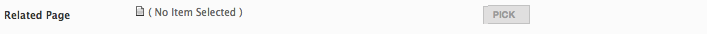

<a href="http://www.vsapartners.com/">
    
</a>
# Typology CMS
A cross channel content management system
***
**Typology CMS** is a PHP based system where content is fully abstracted from layout, making it easy to manage content across multiple channels. Content is stored in structured XML, and creating relationships between content is simple.

The content is accessible as XML to drive any variety of digital applications. Or the content can be transformed via the built in XSLT templating system to deliver content in HTML, different XML schemas, or other data formats.

The **Typology CMS** is ideal for marketing and advertising agencies looking to manage cross-channel campaigns and messaging. It has evolved over almost a decade of creating websites, applications, and digital installations, each iteration of the site yielding valuable features and functionality.

 

##Key Features

**Publishing Flow** - Administrator, Publisher, Author and Editor user levels for a high degree of control over editing and publishing privledges.

**Staging and Production Enivronments** - The system automatically supports a staging and production environment allowing users to create content in draft mode and fully preview it across the site without affecting the live environment. 

**Multi-server Support and Remote Publishing** - The CMS can publish content to multiple remote servers at once, ideal for developers creating systems that require high availability or when the editing environment is behind a firewall.

**Structured Data Types** - Several data types are built into the content templating system, such as date and booleans, making it easy to create content that can be filtered, linked, and organized. 

**Scheduled Publishing** - Scheduled publishing is built in, allowing content to be created, previewed, and queued up for publishing.


##System Requirements
* Apache 2
  *  AllowOverride All 
* Apache Modules:
  * mod_rewrite
* PHP (>= 5.2.6)
* PHP Modules:
  * curl
  * dom
  * gd
  * json
  * libxml
  * mcrypt
  * mysql
  * mbstring
  * SimpleXML
  * xmlrpc
  * xsl
* PHP Options:
  * short_open_tag = On
* MySQL (4 or 5)

##Installation


- Copy deploy directory to document root folder
	- If this is a view-only production site, delete the cms/manage folder
	- Don't forget the htaccess! (normally it is hidden. The hidden files can be shown by using this command in the mac terminal window `defaults write com.apple.finder AppleShowAllFiles YES`
)
- `chmod -R 777` the following directories:
	- cms/local/files
	- cms/system/logs
	- cms/website/cache
	- cms/manage/cache
- Update cms/local/database.php with db credentials
- Visit www.domain.com/install/index.php to set all initial configuration and create a default page.
- Please do remember to remove the install folder after installation.


##Data Types

Data is defined with several XML tags, the behavior of the data is defined with different `type` attributes. 

####textfield:
Defines a single line text input field.

```
<name type="textfield"/>
```
Example:

```
<title type="textfield" />
```


####textarea:
Defines a multi-line text input field. This has an optional attribute of `size="wide"` to make it a wider text field for long format content editing.

```
<name type="textarea" size="wide"/>
```
Example:

```
<text type="textarea" />
```


####checkbox:
Defines a boolean variable that is editable with a checkbox. 
```
<name type="checkbox"/>
```
Example:

```
<show_item type="checkbox" />
```

####checklist:
A wrapper for checkboxes that groups them into a list, similar to a section but consolidates the layout better.

```
<name type="checklist">
</name>

```
Example:

```
<trains type="checklist">
	<no_1 type="checkbox" />
	<no_2 type="checkbox" />
	<no_3 type="checkbox" />
	<no_4 type="checkbox" />
</trains>
```


####select:
Creates a drop-down menu of options. Requires the attribute of `options` to define the list of variables for the drop-down.

```
<name type="select" options=""/>
```
Example:

```
<preferred_seating type="select" option="Window,Aisle,None" />
```


####file:
Creates a node that allows user to upload a file, or select one from the file library. This can be used for images, PDFs, or any other file type. Max file size is controlled in the config panel. Files are stored in the cms/local/files directory. They are renamed based on data ID, but the name is stored in the database and available as an attribute in the XML. When parsing the data for this node the attribues of `file_path`, `file_type`, and `file_name` are available. 

```
<name type="file"/>
```
Example:

```
<download_file type="file" />
```


####pagelink:
Creates a node that allows user to connect other pages, making a sort of symlink between pages in the site. In the editing interface this appears as a picker which opens up a modal browser.

```
<name type="pagelink"/>
```
Example:

```
<related_page type="pagelink" />
```




####section:
Defines a grouping within the data. You can use this to wrap any other data types to nest content. The section defaults to having a border to clearly delineate the section. You can turn that off with the optional `border="none"` attribute.

```
<name type="section" border="none">
</name>
```
Example:

```
<sections type="section" border="none">
	<section type="section" multi="yes">
 		<title type="textfield" />
 		<text type="textarea" />
	  	<button type="href" multi="yes" />
	</section>
</sections>
```


####space:
Not a data node. This is an XML tag you can add to put some spacing into the CMS editor view in case you want some extra for formatting. 

```
<space/>
```

####edit_tab:
Not a data node. This is an XML tag you can add to put separate your editing interface into tabs. With more complex content types there is so much input that it is often valuable to make separate tabs (e.g a "project" has an "info" tab and "images" tab). When the content is rendered to XML it acts the same as a section, defining a wrapper around a heirarchy of nodes. 

```
<name type="edit_tab">
</name>
```

Example:

```
<info type="edit_tab">
	<header_copy type="textfield"/>
	<body_copy type="textarea"/>
</info>
<images type="edit_tab">
	<image type="file"/>
</images>
```


##Data Type Options

The XML data tags all take a few standard options that can be used to add functionality and information to the editing experience.

####title
The title in the edit view is by default based on the node name. However, you can over-ride that with a more human-readable title by using the `title` attribute

Example:

```
<image_def type="file" title="Default Image"/>
```


####notes
Sometimes the editor needs a little more information to guide the user. The `notes` attribute adds a text note under the input field to provide more information about the expected input.

Example:

```
<image_def type="file" title="Default Image" notes="Recommended Size - 200x200px"/>
```


####multi
The `multi` attribute makes any data node a repeatble node. It adds a + and - to the inteface so users can add and delete items. A set of sort arrows is also added, click that allows drag-and-drop sorting. Typically you will want to group multi items in a section to keep the XML structure clean.

Example:

```
<section type="section" multi="yes">
  <title type="textfield" />
  <text type="textarea" />
</section>

```

